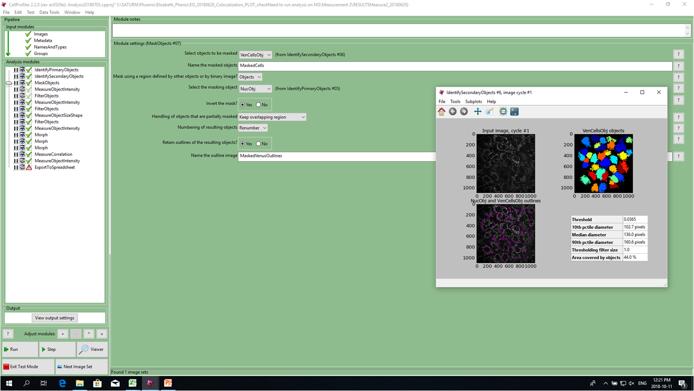
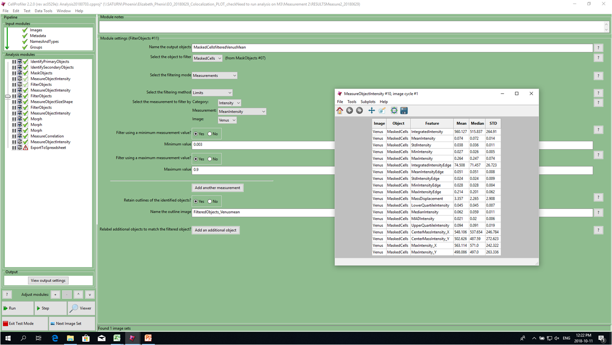
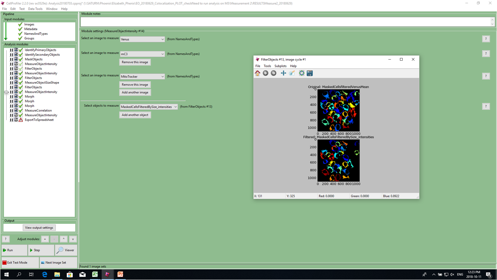

# Protein Binding and Colocalization Analysis for Confocal Live Cell Imaging 
This is a step-by-step guide for performing analysis on acqruied confocal images for live cells. 
The images for the colocalization analysis were acqruied using the Opera Phenix. A multi-channel spinning disk confocal instrument. The images for FLIM-FRET experiment were acquired using The ISS Alb confocal FLIM Microscope. 

The repository includes:
* CellProfiler Project which includes the colocalizatoin pipeline which was used to perofrm multi-channel colocalziation analysis
* ImageJ macro to extract binding profiles from FLIM confocal images. 

# PART A - Multi-Channel Colocalization Analysis
# Step by Step Colocolization Analysis
## 1. Adding Images to CellProfiler and 
Drag and Drop the images in the Files list in Cell Profiler

## 2. Seperate Images Into Different Channels
Each channel represents a different fluorophore/fluorescenly tagged protein imaged at a specific wavlength.
For our data:
* Ch1 = MitoTracker channel
* Ch2 = Nuclear stain channel
* Ch3 = Venus labelled proteins channel
* Ch4 = mCerulean(3) labelled proteins channel

## 3. Cell Segmentation
Cell profiler uses the nuclear channel to identify primary objects. Primary objects are used as seeds which inidcate the cellular position. Secondary Objects are then used to identify the borders (Cell body) for the objects where the seeds are initiated. 
We use the nuclei as the primary objects and the Venus channel to identify secondary objects (Cell boundaries).

## 3. Cell Body Mask and Excluding the Nuclii
Protein colocalization needs to be quantified within the cellular boundaries (excluding the nucleus). We use CellProfile's masking to exclude the nuclii (primary objects) from our cell boundaries (secondary objects)

## 4. Removing Low Expressing and Highly Expressing Cells
Prior to perofroming the colocalization analysis we need to remove cells that are not expressing enought proteins (low signal to noise) and cells that are expressing too much proteins (saturated signal). We measure the mean intensity (cell boundaries only) for our Venus labelled proteins. We apply an intensity threshold to remove these cells from our analysis
###NOTE: CellProfiler Normalizes 16-bit images to values in the range {0,1}

## 5. Removing Dead Cells
We also need to exclude dead cells from our colocalization analysis. We identify dead cells by their size. We measure the area for the cell bodies and remove objects below a certain size. For our images we chose 5,000 pixels as the lower size limit for a live cell. We also include a 30,000 pixel upper limit for the odd cases where the segmentation combines multiple cells together. 

## 6. Multi-Channel Colocalization Analysis
We use Top-Hat (Rolling Ball Approach) to perform background subtraction to all channels prior to measuring the colocalization. The colocalization is measured for the identified cellular objects between multiple channels. In our case we compare the colocalization of:
* mCerulean3 labelled proteins to MitoTracker
* Venus to MitoTracker labelled proteins to MitoTracker
* mCerulean3 labelled proteins to Venus labelled proteins

